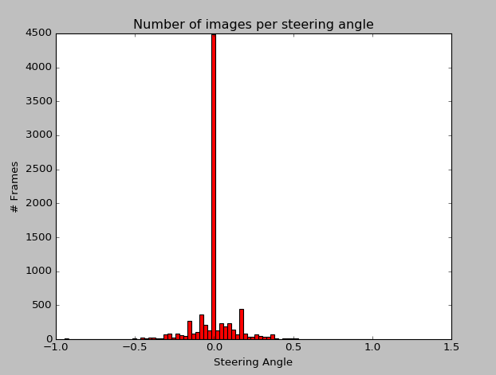

# CardND - Behaviorial Cloning Project


## Overview
---

### Objectives

The goals / steps of this project are the following:

* Use the simulator to collect data of good driving behavior 
* Design, train and validate a model that predicts a steering angle from image data
* Use the model to drive the vehicle autonomously around the first track in the simulator. The vehicle should remain on the road for an entire loop around the track.
* Summarize the results with a written report

<sub>
References - 

1. https://srikanthpagadala.github.io/serve/carnd-behavioral-cloning-p3-report.html
1. https://github.com/ksakmann/CarND-BehavioralCloning
1. https://github.com/upul/Behavioral-Cloning

</sub>


### Running the model

The trained model is stored in the `model.json`, `model_wts.h5` and `model.h5` files and can be run using the command

`python3.5 drive.py model.json`


### Environment Details

The environment details that were used to train and test the model are stored in the `env.yml` file. To train the model again simply use 

`python3.5 model.py`


## Data Collection
---

### Data Visualization

The first part of the project was to get enough data for the model to train properly. Udacity has provided some starting data to speed up the things and it is available [here](https://d17h27t6h515a5.cloudfront.net/topher/2016/December/584f6edd_data/data.zip)

After downoading the data, the first thing I did was analyze it to get to know the areas that have the least data. The code for the visualization is available in `visualize.py` file. Upon visualization I ealized that the data povided is highly biased towards very low steering angles.




### Data Augmentation

The next step logical step was to collect more data. I first tried creating new data by driving around in the simulator but since it was taking too long and using whatever data that I had collected till now showed little improvement, I decided to go for data augmentation using existing image manipualtion. I defined the following functions

```
crop - returns a cropped image contaning only the relvant details to speed up the processing
```

```
resize -  return an image resized to specified dimensions to be used for training
```

```
random_flip - flips an image along lr axis based on a predefined probability and returns the new image and steering angle
```

```
random_gamma -  used as an alternative method changing the brightness of training images. 
Ref - http://www.pyimagesearch.com/2015/10/05/opencv-gamma-correction
```

```
random_shear - Applies a random shear to the image
Ref: https://medium.com/@ksakmann/behavioral-cloning-make-a-car-drive-like-yourself-dc6021152713#.7k8vfppvk
```

The code for all these is available is the `helper.py` file. After defining all the helper function for data augmentationI defined a pipeline to generate the new image. The pipeline applies each of these in a specific order and then returns the new image and steering angle

I also experimented with applying a random translation along with the manipulations above but it led to worse performance and was discarded.


## Model
---

### Definition


I defined a convolutional neural network architecture inspired by NVIDIA's End to End Learning for Self-Driving Cars. The model is defined in `model.py` 

The main difference between my model and the NVIDIA mode is the use of MaxPooling layers just after each Convolutional Layer in order to cut down training time. 

```
_________________________________________________________________
Layer (type)                 Output Shape              Param #   
=================================================================
lambda_1 (Lambda)            (None, 64, 64, 3)         0         
_________________________________________________________________
conv2d_1 (Conv2D)            (None, 32, 32, 24)        1824      
_________________________________________________________________
activation_1 (Activation)    (None, 32, 32, 24)        0         
_________________________________________________________________
max_pooling2d_1 (MaxPooling2 (None, 31, 31, 24)        0         
_________________________________________________________________
conv2d_2 (Conv2D)            (None, 16, 16, 36)        21636     
_________________________________________________________________
activation_2 (Activation)    (None, 16, 16, 36)        0         
_________________________________________________________________
max_pooling2d_2 (MaxPooling2 (None, 15, 15, 36)        0         
_________________________________________________________________
conv2d_3 (Conv2D)            (None, 8, 8, 48)          43248     
_________________________________________________________________
activation_3 (Activation)    (None, 8, 8, 48)          0         
_________________________________________________________________
max_pooling2d_3 (MaxPooling2 (None, 7, 7, 48)          0         
_________________________________________________________________
conv2d_4 (Conv2D)            (None, 7, 7, 64)          27712     
_________________________________________________________________
activation_4 (Activation)    (None, 7, 7, 64)          0         
_________________________________________________________________
max_pooling2d_4 (MaxPooling2 (None, 6, 6, 64)          0         
_________________________________________________________________
conv2d_5 (Conv2D)            (None, 6, 6, 64)          36928     
_________________________________________________________________
activation_5 (Activation)    (None, 6, 6, 64)          0         
_________________________________________________________________
max_pooling2d_5 (MaxPooling2 (None, 5, 5, 64)          0         
_________________________________________________________________
flatten_1 (Flatten)          (None, 1600)              0         
_________________________________________________________________
dense_1 (Dense)              (None, 1164)              1863564   
_________________________________________________________________
activation_6 (Activation)    (None, 1164)              0         
_________________________________________________________________
dense_2 (Dense)              (None, 100)               116500    
_________________________________________________________________
activation_7 (Activation)    (None, 100)               0         
_________________________________________________________________
dense_3 (Dense)              (None, 50)                5050      
_________________________________________________________________
activation_8 (Activation)    (None, 50)                0         
_________________________________________________________________
dense_4 (Dense)              (None, 10)                510       
_________________________________________________________________
activation_9 (Activation)    (None, 10)                0         
_________________________________________________________________
dense_5 (Dense)              (None, 1)                 11        
=================================================================
Total params: 2,116,983.0
Trainable params: 2,116,983.0
Non-trainable params: 0.0

```


### Training

Using the fit_generator API of the Keras, I defined  two generators namely:
```
    train_gen = helper.generate_next_batch()
    validation_gen = helper.generate_next_batch()
```

The training was then done using the following parameters

```
batch_size = 64
images_per_epoch = 20032
validation_images = 6400
learning_rate = 0.0001
optimizer = keras.optimizers.Adam
number of epochs = 8
```

The images for training and validation were generated at runtime using the pipeline created in the previous step.


## Results
---

The follwoing result was obtained after tweaking all the parameters manually

Training Track

[](https://www.youtube.com/watch?v=e9k0bJ1MJn0)


## Discussions 
---

I first started by trying to create my own dataset by driving around the track but since it did not seem like a feasible option, I augemented the dataset provided by Udacity and trained my model on it. The model works pretty good on track 1, as seen in the video. On track 2, the model starts fine but as soon as it encounters a turn that needed an extremely high steering angle it fails because of the lack of suh samples in the training dataset. The video for the track 2 is available [here](./track2_output.mp4)

The model's performance can be improved by providing a more diverse data for taining, something that has more tighter corners and bigger turns so that the model knows what to do in such cases. To enhance the data other data augmentation technoques can also be looked at. In order to train the model to more realisitic scenarios, we also need to provide data with obstacles and traffic rules and signs. Also, training the model for more epochs, might also imporve its performance